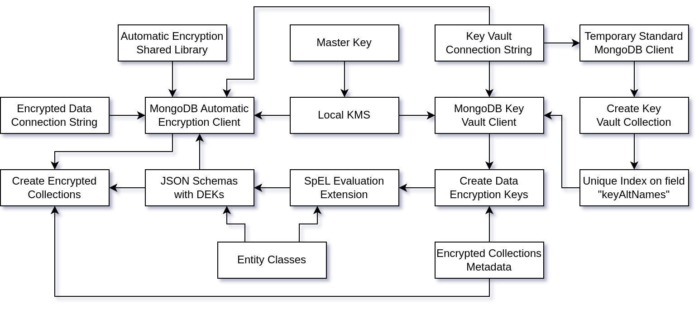
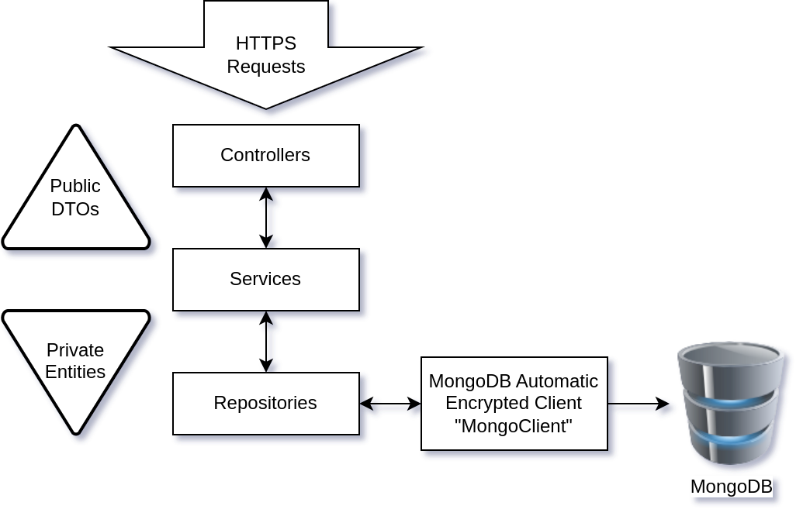

## TODO

- Check the repository links
- Move my code to mongodb-repository.
    - https://github.com/mongodb-developer/java-spring-boot-csfle
    - https://github.com/MaBeuLux88/mongodb-java-spring-boot-csfle

## GitHub Repository

The source code of this template is available on GitHub:

```bash
git clone https://github.com/mongodb-developer/java-spring-boot-csfle
```

To get started, you'll need:

- Java 17 (can't use Java 21 yet because Spring Boot 3.1.4 is not compatible)
- [MongoDB Cluster](https://www.mongodb.com/atlas/database) v7.0.2 or higher.
- [MongoDB Automatic Encryption Shared Library](https://www.mongodb.com/docs/manual/core/queryable-encryption/reference/shared-library/#download-the-automatic-encryption-shared-library)
  v7.0.2 or higher.

See the [README.md](https://github.com/mongodb-developer/java-spring-boot-csfle/blob/main/README.md) file for more
information.

## Introduction

This blog post will explain the key details of the integration of
MongoDB [Client-Side Field Level Encryption](https://www.mongodb.com/docs/manual/core/csfle/) (CSFLE)
with [Spring Data MongoDB](https://spring.io/projects/spring-data-mongodb).

However, this blog post will *not* explain the basic mechanics of CSFLE
or [Spring Data MongoDB](https://spring.io/projects/spring-data-mongodb).

If you feel like you need a refresher on CSFLE before working on this more complicated piece, I can recommend a few
resources for CSFLE:

- My blog post /
  tutorial: [CSFLE with Java](https://www.mongodb.com/developer/languages/java/java-client-side-field-level-encryption/) (
  without Spring Data...)
- [CSFLE MongoDB Documentation](https://www.mongodb.com/docs/manual/core/csfle/)
- [CSFLE Encryption Schemas](https://www.mongodb.com/docs/manual/core/csfle/reference/encryption-schemas/)
- [CSFLE Quick Start](https://www.mongodb.com/docs/manual/core/csfle/quick-start/)

And for Spring Data MongoDB:

- [Spring Data MongoDB - Project](https://spring.io/projects/spring-data-mongodb)
- [Spring Data MongoDB - Documentation](https://docs.spring.io/spring-data/mongodb/docs/current/reference/html/)
- [Baeldung Spring Data MongoDB Tutorial](https://www.baeldung.com/spring-data-mongodb-tutorial)
- [Spring Initializr](https://start.spring.io/)

## High Level Diagram

Now that we are all on board, here is a high level diagram of the different moving parts required to create a correctly
configured MongoClient which can encrypt and decrypt fields automatically.



The arrows can mean different things in the diagram:

- "needs to be done before"
- "requires"
- "direct dependency of"

But hopefully it helps to understand the dependencies, the orchestration and the inner machinery of the CSFLE
configuration with Spring Data MongoDB:

Once the connection with MongoDB—capable of encrypting and decrypting the fields—is established, with the correct
configuration and library, we are just using a classical three-tier architecture to expose a REST API and manage the
communication all the way down to the MongoDB database.



Here again, nothing tricky or fascinating to discuss, so we are not going to discuss this here.

## Creation of the Key Vault Collection

As this is a tutorial, the code can be started from a blank MongoDB cluster.

So first point of order is to create the key vault collection and its unique index on the `keyAltNames` field.

[KeyVaultAndDekSetup.java](https://github.com/MaBeuLux88/mongodb-java-spring-boot-csfle/blob/main/src/main/java/com/mongodb/quickstart/javaspringbootcsfle/components/KeyVaultAndDekSetup.java)

```java
/**
 * This class initialize the Key Vault (collection + keyAltNames unique index) using a dedicated standard connection
 * to MongoDB.
 * Then it creates the Data Encryption Keys (DEKs) required to encrypt the documents in each of the
 * encrypted collections.
 */
@Component
public class KeyVaultAndDekSetup {

    private static final Logger LOGGER = LoggerFactory.getLogger(KeyVaultAndDekSetup.class);
    private final KeyVaultService keyVaultService;
    private final DataEncryptionKeyService dataEncryptionKeyService;
    @Value("${spring.data.mongodb.vault.uri}")
    private String CONNECTION_STR;

    public KeyVaultAndDekSetup(KeyVaultService keyVaultService, DataEncryptionKeyService dataEncryptionKeyService) {
        this.keyVaultService = keyVaultService;
        this.dataEncryptionKeyService = dataEncryptionKeyService;
    }

    @PostConstruct
    public void postConstruct() {
        LOGGER.info("=> Start Encryption Setup.");
        LOGGER.debug("=> MongoDB Connection String: {}", CONNECTION_STR);
        MongoClientSettings mcs = MongoClientSettings.builder()
                                                     .applyConnectionString(new ConnectionString(CONNECTION_STR))
                                                     .build();
        try (MongoClient client = MongoClients.create(mcs)) {
            LOGGER.info("=> Created the MongoClient instance for the encryption setup.");
            LOGGER.info("=> Creating the encryption key vault collection.");
            keyVaultService.setupKeyVaultCollection(client);
            LOGGER.info("=> Creating the Data Encryption Keys.");
            EncryptedCollectionsConfiguration.encryptedEntities.forEach(dataEncryptionKeyService::createOrRetrieveDEK);
            LOGGER.info("=> Encryption Setup completed.");
        } catch (Exception e) {
            LOGGER.error("=> Encryption Setup failed: {}", e.getMessage(), e);
        }

    }

}
```

In production, you could choose to create the key vault collection and its unique index on the `keyAltNames` field
manually once and remove the code as it's never going to be executed again. I guess it only makes sense to keep it if
you are running this code in a CI/CD pipeline.

One important thing to note here is the dependency to a completely standard and ephemeral `MongoClient` (use of a
try-with-resources block) as we are already creating a collection and an
index in our MongoDB cluster.

[KeyVaultServiceImpl.java](https://github.com/MaBeuLux88/mongodb-java-spring-boot-csfle/blob/main/src/main/java/com/mongodb/quickstart/javaspringbootcsfle/csfleServiceImpl/KeyVaultServiceImpl.java)

```java
/**
 * Initialization of the Key Vault collection and keyAltNames unique index.
 */
@Service
public class KeyVaultServiceImpl implements KeyVaultService {

    private static final Logger LOGGER = LoggerFactory.getLogger(KeyVaultServiceImpl.class);
    private static final String INDEX_NAME = "uniqueKeyAltNames";
    @Value("${mongodb.key.vault.db}")
    private String KEY_VAULT_DB;
    @Value("${mongodb.key.vault.coll}")
    private String KEY_VAULT_COLL;

    public void setupKeyVaultCollection(MongoClient mongoClient) {
        LOGGER.info("=> Setup the key vault collection {}.{}", KEY_VAULT_DB, KEY_VAULT_COLL);
        MongoDatabase db = mongoClient.getDatabase(KEY_VAULT_DB);
        MongoCollection<Document> vault = db.getCollection(KEY_VAULT_COLL);
        boolean vaultExists = doesCollectionExist(db, KEY_VAULT_COLL);
        if (vaultExists) {
            LOGGER.info("=> Vault collection already exists.");
            if (!doesIndexExist(vault)) {
                LOGGER.info("=> Unique index created on the keyAltNames");
                createKeyVaultIndex(vault);
            }
        } else {
            LOGGER.info("=> Creating a new vault collection & index on keyAltNames.");
            createKeyVaultIndex(vault);
        }
    }

    private void createKeyVaultIndex(MongoCollection<Document> vault) {
        Bson keyAltNamesExists = exists("keyAltNames");
        IndexOptions indexOpts = new IndexOptions().name(INDEX_NAME)
                                                   .partialFilterExpression(keyAltNamesExists)
                                                   .unique(true);
        vault.createIndex(new BsonDocument("keyAltNames", new BsonInt32(1)), indexOpts);
    }

    private boolean doesCollectionExist(MongoDatabase db, String coll) {
        return db.listCollectionNames().into(new ArrayList<>()).stream().anyMatch(c -> c.equals(coll));
    }

    private boolean doesIndexExist(MongoCollection<Document> coll) {
        return coll.listIndexes()
                   .into(new ArrayList<>())
                   .stream()
                   .map(i -> i.get("name"))
                   .anyMatch(n -> n.equals(INDEX_NAME));
    }
}
```

When it's done, we can close the standard MongoDB connection.

## Creation of the Data Encryption Keys

We can now create the Data Encryption Keys (DEKs) using the `ClientEncryption` connection.

[MongoDBKeyVaultClientConfiguration.java](https://github.com/MaBeuLux88/mongodb-java-spring-boot-csfle/blob/main/src/main/java/com/mongodb/quickstart/javaspringbootcsfle/configuration/MongoDBKeyVaultClientConfiguration.java)

```java
/**
 * ClientEncryption used by the DataEncryptionKeyService to create the DEKs.
 */
@Configuration
public class MongoDBKeyVaultClientConfiguration {

    private static final Logger LOGGER = LoggerFactory.getLogger(MongoDBKeyVaultClientConfiguration.class);
    private final KmsService kmsService;
    @Value("${spring.data.mongodb.vault.uri}")
    private String CONNECTION_STR;
    @Value("${mongodb.key.vault.db}")
    private String KEY_VAULT_DB;
    @Value("${mongodb.key.vault.coll}")
    private String KEY_VAULT_COLL;
    private MongoNamespace KEY_VAULT_NS;

    public MongoDBKeyVaultClientConfiguration(KmsService kmsService) {
        this.kmsService = kmsService;
    }

    @PostConstruct
    public void postConstructor() {
        this.KEY_VAULT_NS = new MongoNamespace(KEY_VAULT_DB, KEY_VAULT_COLL);
    }

    /**
     * MongoDB Encryption Client that can manage Data Encryption Keys (DEKs).
     *
     * @return ClientEncryption MongoDB connection that can create or delete DEKs.
     */
    @Bean
    public ClientEncryption clientEncryption() {
        LOGGER.info("=> Creating the MongoDB Key Vault Client.");
        MongoClientSettings mcs = MongoClientSettings.builder()
                                                     .applyConnectionString(new ConnectionString(CONNECTION_STR))
                                                     .build();
        ClientEncryptionSettings ces = ClientEncryptionSettings.builder()
                                                               .keyVaultMongoClientSettings(mcs)
                                                               .keyVaultNamespace(KEY_VAULT_NS.getFullName())
                                                               .kmsProviders(kmsService.getKmsProviders())
                                                               .build();
        return ClientEncryptions.create(ces);
    }
}
```

We can instantiate directly a `ClientEncryption` bean using
the [KMS](https://www.mongodb.com/docs/manual/core/queryable-encryption/fundamentals/kms-providers/) and use it to
generate our DEKs.

[DataEncryptionKeyServiceImpl.java](https://github.com/MaBeuLux88/mongodb-java-spring-boot-csfle/blob/main/src/main/java/com/mongodb/quickstart/javaspringbootcsfle/csfleServiceImpl/DataEncryptionKeyServiceImpl.java)

```java
/**
 * Service responsible for creating and remembering the Data Encryption Keys (DEKs).
 * We need to retrieve the DEKs when we evaluate the SpEL expressions in the Entities to create the JSON Schemas.
 */
@Service
public class DataEncryptionKeyServiceImpl implements DataEncryptionKeyService {

    private static final Logger LOGGER = LoggerFactory.getLogger(DataEncryptionKeyServiceImpl.class);
    private final ClientEncryption clientEncryption;
    private final Map<String, String> dataEncryptionKeysB64 = new HashMap<>();
    @Value("${mongodb.kms.provider}")
    private String KMS_PROVIDER;

    public DataEncryptionKeyServiceImpl(ClientEncryption clientEncryption) {
        this.clientEncryption = clientEncryption;
    }

    public Map<String, String> getDataEncryptionKeysB64() {
        LOGGER.info("=> Getting Data Encryption Keys Base64 Map.");
        LOGGER.info("=> Keys in DEK Map: {}", dataEncryptionKeysB64.entrySet());
        return dataEncryptionKeysB64;
    }

    public String createOrRetrieveDEK(EncryptedEntity encryptedEntity) {
        Base64.Encoder b64Encoder = Base64.getEncoder();
        String dekName = encryptedEntity.getDekName();
        BsonDocument dek = clientEncryption.getKeyByAltName(dekName);
        BsonBinary dataKeyId;
        if (dek == null) {
            LOGGER.info("=> Creating Data Encryption Key: {}", dekName);
            DataKeyOptions dko = new DataKeyOptions().keyAltNames(of(dekName));
            dataKeyId = clientEncryption.createDataKey(KMS_PROVIDER, dko);
            LOGGER.debug("=> DEK ID: {}", dataKeyId);
        } else {
            LOGGER.info("=> Existing Data Encryption Key: {}", dekName);
            dataKeyId = dek.get("_id").asBinary();
            LOGGER.debug("=> DEK ID: {}", dataKeyId);
        }
        String dek64 = b64Encoder.encodeToString(dataKeyId.getData());
        LOGGER.debug("=> Base64 DEK ID: {}", dek64);
        LOGGER.info("=> Adding Data Encryption Key to the Map with key: {}",
                    encryptedEntity.getEntityClass().getSimpleName());
        dataEncryptionKeysB64.put(encryptedEntity.getEntityClass().getSimpleName(), dek64);
        return dek64;
    }

}
```

One thing to note here is that we are storing the DEKs in a map, so we don't have to retrieve them again later when we
need them for the JSON Schemas.

## Entities

One of the key functional areas of Spring Data MongoDB is the POJO centric model it relies on to implement the
repositories and map the documents to the MongoDB collections.

PersonEntity.java

```java
/**
 * This is the entity class for the "persons" collection.
 * The SpEL expression of the @Encrypted annotation is used to determine the DEK's keyId to use for the encryption.
 *
 * @see com.mongodb.quickstart.javaspringbootcsfle.components.EntitySpelEvaluationExtension
 */
@Document("persons")
@Encrypted(keyId = "#{mongocrypt.keyId(#target)}")
public class PersonEntity {
    @Id
    private ObjectId id;
    private String firstName;
    private String lastName;
    @Encrypted(algorithm = "AEAD_AES_256_CBC_HMAC_SHA_512-Deterministic")
    private String ssn;
    @Encrypted(algorithm = "AEAD_AES_256_CBC_HMAC_SHA_512-Random")
    private String bloodType;

    public PersonEntity() {
    }

    public PersonEntity(ObjectId id, String firstName, String lastName, String ssn, String bloodType) {
        this.id = id;
        this.firstName = firstName;
        this.lastName = lastName;
        this.ssn = ssn;
        this.bloodType = bloodType;
    }

    @Override
    // toString()

    // Getters & Setters
}
```

As you can see above, this entity contains all the information we need to fully automate CSFLE. We have the information
we need to generate the JSON Schema:

- Using the SpEL expression `#{mongocrypt.keyId(#target)}` we can populate dynamically the DEK that was generated or
  retrieved earlier.
- `ssn` is a String that requires a deterministic algorithm.
- `bloodType` is a String that requires a random algorithm.

We have everything we need to generate this JSON Schema automatically.

```json
{
  "encryptMetadata": {
    "keyId": [
      {
        "$binary": {
          "base64": "WyHXZ+53SSqCC/6WdCvp0w==",
          "subType": "04"
        }
      }
    ]
  },
  "type": "object",
  "properties": {
    "ssn": {
      "encrypt": {
        "bsonType": "string",
        "algorithm": "AEAD_AES_256_CBC_HMAC_SHA_512-Deterministic"
      }
    },
    "bloodType": {
      "encrypt": {
        "bsonType": "string",
        "algorithm": "AEAD_AES_256_CBC_HMAC_SHA_512-Random"
      }
    }
  }
}
```

## SpEL Evaluation Extension

The evaluation of the SpEL expression is only possible because of this class we added in the configuration:

```java
/**
 * Will evaluate the SePL expressions in the Entity classes like this: #{mongocrypt.keyId(#target)} and insert
 * the right encryption key for the right collection.
 */
@Component
public class EntitySpelEvaluationExtension implements EvaluationContextExtension {

    private static final Logger LOGGER = LoggerFactory.getLogger(EntitySpelEvaluationExtension.class);
    private final DataEncryptionKeyService dataEncryptionKeyService;

    public EntitySpelEvaluationExtension(DataEncryptionKeyService dataEncryptionKeyService) {
        this.dataEncryptionKeyService = dataEncryptionKeyService;
    }

    @Override
    @NonNull
    public String getExtensionId() {
        return "mongocrypt";
    }

    @Override
    @NonNull
    public Map<String, Function> getFunctions() {
        try {
            return Collections.singletonMap("keyId", new Function(
                    EntitySpelEvaluationExtension.class.getMethod("computeKeyId", String.class), this));
        } catch (NoSuchMethodException e) {
            throw new RuntimeException(e);
        }
    }

    public String computeKeyId(String target) {
        String dek = dataEncryptionKeyService.getDataEncryptionKeysB64().get(target);
        LOGGER.info("=> Computing dek for target {} => {}", target, dek);
        return dek;
    }
}
```

Note that it's the place where we are retrieving the DEKs and matching them with the `target`: "PersonEntity" in this
case.

## JSON Schemas and the MongoClient Connection

JSON Schemas are actually not trivial to generate in a Spring Data MongoDB project.

As a matter of fact, to generate the JSON Schemas, we need the MappingContext (the entities, etc.) which is created by
the automatic
configuration of Spring Data which creates the `MongoClient` connection and the `MongoTemplate`...

But to create the MongoClient—with the automatic encryption enabled—you need the JSON Schemas!

It took me a significant amount of time to find a solution to this deadlock and you can just enjoy the solution now!

The solution is to inject the JSON Schema creation in the autoconfiguration process by instantiating
the `MongoClientSettingsBuilderCustomizer` bean.

[MongoDBSecureClientConfiguration.java](https://github.com/MaBeuLux88/mongodb-java-spring-boot-csfle/blob/main/src/main/java/com/mongodb/quickstart/javaspringbootcsfle/configuration/MongoDBSecureClientConfiguration.java)

```java
/**
 * Spring Data MongoDB Configuration for the encrypted MongoClient with all the required configuration (jsonSchemas).
 * The big trick in this file is the creation of the JSON Schemas before the creation of the entire configuration as
 * we need the MappingContext to resolve the SpEL expressions in the entities.
 *
 * @see com.mongodb.quickstart.javaspringbootcsfle.components.EntitySpelEvaluationExtension
 */
@Configuration
@DependsOn("keyVaultAndDekSetup")
public class MongoDBSecureClientConfiguration {

    private static final Logger LOGGER = LoggerFactory.getLogger(MongoDBSecureClientConfiguration.class);
    private final KmsService kmsService;
    private final SchemaService schemaService;
    @Value("${crypt.shared.lib.path}")
    private String CRYPT_SHARED_LIB_PATH;
    @Value("${spring.data.mongodb.storage.uri}")
    private String CONNECTION_STR_DATA;
    @Value("${spring.data.mongodb.vault.uri}")
    private String CONNECTION_STR_VAULT;
    @Value("${mongodb.key.vault.db}")
    private String KEY_VAULT_DB;
    @Value("${mongodb.key.vault.coll}")
    private String KEY_VAULT_COLL;
    private MongoNamespace KEY_VAULT_NS;

    public MongoDBSecureClientConfiguration(KmsService kmsService, SchemaService schemaService) {
        this.kmsService = kmsService;
        this.schemaService = schemaService;
    }

    @PostConstruct
    public void postConstruct() {
        this.KEY_VAULT_NS = new MongoNamespace(KEY_VAULT_DB, KEY_VAULT_COLL);
    }

    @Bean
    public MongoClientSettings mongoClientSettings() {
        LOGGER.info("=> Creating the MongoClientSettings for the encrypted collections.");
        return MongoClientSettings.builder().applyConnectionString(new ConnectionString(CONNECTION_STR_DATA)).build();
    }

    @Bean
    public MongoClientSettingsBuilderCustomizer customizer(MappingContext mappingContext) {
        LOGGER.info("=> Creating the MongoClientSettingsBuilderCustomizer.");
        return builder -> {
            MongoJsonSchemaCreator schemaCreator = MongoJsonSchemaCreator.create(mappingContext);
            Map<String, BsonDocument> schemaMap = schemaService.generateSchemasMap(schemaCreator)
                                                               .entrySet()
                                                               .stream()
                                                               .collect(toMap(e -> e.getKey().getFullName(),
                                                                              Map.Entry::getValue));
            Map<String, Object> extraOptions = Map.of("cryptSharedLibPath", CRYPT_SHARED_LIB_PATH,
                                                      "cryptSharedLibRequired", true);
            MongoClientSettings mcs = MongoClientSettings.builder()
                                                         .applyConnectionString(
                                                                 new ConnectionString(CONNECTION_STR_VAULT))
                                                         .build();
            AutoEncryptionSettings oes = AutoEncryptionSettings.builder()
                                                               .keyVaultMongoClientSettings(mcs)
                                                               .keyVaultNamespace(KEY_VAULT_NS.getFullName())
                                                               .kmsProviders(kmsService.getKmsProviders())
                                                               .schemaMap(schemaMap)
                                                               .extraOptions(extraOptions)
                                                               .build();
            builder.autoEncryptionSettings(oes);
        };
    }
}
```

> One thing to note here is the option to separate the DEKs from the encrypted collections in two completely separated
> MongoDB clusters. This isn't mandatory, but it can be a handy trick if you choose to have a different backup retention
> policy for your two clusters. This can be interesting for the GDPR Article 17 "Right to erasure" for instance as you can
> then guarantee that a DEK can completely disappear from your systems (backup included). I talk more about this approach
> in this [Java CSFLE blog post](https://www.mongodb.com/developer/languages/java/java-client-side-field-level-encryption/). 

Here is the JSON Schema service which stores the generated JSON schemas in a map:  

[SchemaServiceImpl.java](https://github.com/MaBeuLux88/mongodb-java-spring-boot-csfle/blob/main/src/main/java/com/mongodb/quickstart/javaspringbootcsfle/csfleServiceImpl/SchemaServiceImpl.java)

```java

@Service
public class SchemaServiceImpl implements SchemaService {

    private static final Logger LOGGER = LoggerFactory.getLogger(SchemaServiceImpl.class);
    private Map<MongoNamespace, BsonDocument> schemasMap;

    @Override
    public Map<MongoNamespace, BsonDocument> generateSchemasMap(MongoJsonSchemaCreator schemaCreator) {
        LOGGER.info("=> Generating schema map.");
        List<EncryptedEntity> encryptedEntities = EncryptedCollectionsConfiguration.encryptedEntities;
        return schemasMap = encryptedEntities.stream()
                                             .collect(toMap(EncryptedEntity::getNamespace,
                                                            e -> generateSchema(schemaCreator, e.getEntityClass())));
    }

    @Override
    public Map<MongoNamespace, BsonDocument> getSchemasMap() {
        return schemasMap;
    }

    private BsonDocument generateSchema(MongoJsonSchemaCreator schemaCreator, Class<?> entityClass) {
        BsonDocument schema = schemaCreator.filter(MongoJsonSchemaCreator.encryptedOnly())
                                           .createSchemaFor(entityClass)
                                           .schemaDocument()
                                           .toBsonDocument();
        LOGGER.info("=> JSON Schema for {}:\n{}", entityClass.getSimpleName(),
                    schema.toJson(JsonWriterSettings.builder().indent(true).build()));
        return schema;
    }

}
```

