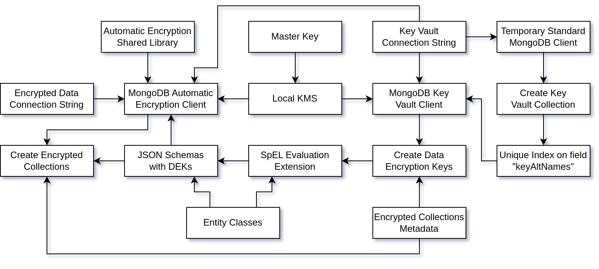

## TODO

- Check the repository links
- Move my code to mongodb-repository.
  - https://github.com/mongodb-developer/java-spring-boot-csfle
  - https://github.com/MaBeuLux88/mongodb-java-spring-boot-csfle

## GitHub Repository

The source code of this template is available on GitHub:

```bash
git clone https://github.com/mongodb-developer/java-spring-boot-csfle
```

To get started, you'll need: 

- Java 17 (can't use Java 21 yet because Spring Boot 3.1.4 is not compatible)
- [MongoDB Cluster](https://www.mongodb.com/atlas/database) v7.0.2 or higher.
- [MongoDB Automatic Encryption Shared Library](https://www.mongodb.com/docs/manual/core/queryable-encryption/reference/shared-library/#download-the-automatic-encryption-shared-library)
  v7.0.2 or higher.

See the [README.md](https://github.com/mongodb-developer/java-spring-boot-csfle/blob/main/README.md) file for more information.

## Introduction

This blog post will explain the key details of the integration of MongoDB [Client-Side Field Level Encryption](https://www.mongodb.com/docs/manual/core/csfle/) (CSFLE) with [Spring Data MongoDB](https://spring.io/projects/spring-data-mongodb).


However, this blog post will *not* explain the basic mechanics of CSFLE or [Spring Data MongoDB](https://spring.io/projects/spring-data-mongodb).

If you feel like you need a refresher on CSFLE before working on this more complicated piece, I can recommend a few resources for CSFLE: 
- My blog post / tutorial: [CSFLE with Java](https://www.mongodb.com/developer/languages/java/java-client-side-field-level-encryption/) (without Spring Data...)
- [CSFLE MongoDB Documentation](https://www.mongodb.com/docs/manual/core/csfle/)
- [CSFLE Encryption Schemas](https://www.mongodb.com/docs/manual/core/csfle/reference/encryption-schemas/)
- [CSFLE Quick Start](https://www.mongodb.com/docs/manual/core/csfle/quick-start/)

And for Spring Data MongoDB:
- [Spring Data MongoDB - Project](https://spring.io/projects/spring-data-mongodb)
- [Spring Data MongoDB - Documentation](https://docs.spring.io/spring-data/mongodb/docs/current/reference/html/)
- [Baeldung Spring Data MongoDB Tutorial](https://www.baeldung.com/spring-data-mongodb-tutorial)
- [Spring Initializr](https://start.spring.io/)

## High Level Diagram

Now that we are all on board, here is a high level diagram of the different moving parts required to create a correctly configured MongoClient which can encrypt and decrypt fields automatically.



Once the connection with MongoDB is established with the correct configuration and library, we are just using the classic 


